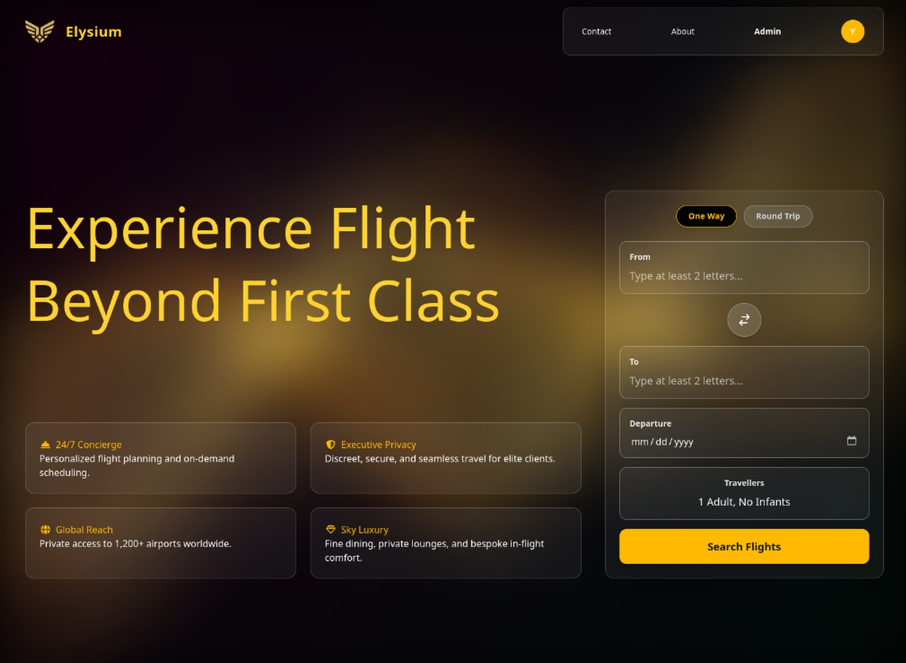

 
# ✈️ Elysium

This is a web app our team is building to make booking flights easier.  
It lets users search for flights, book tickets, and manage their bookings all in one place.

---

## Project Idea

Flight Management System is a full-stack web application that enables users to search, book, and manage flight reservations online. The platform features secure
authentication (including Google OAuth), comprehensive booking workflows with seat selection, meal preferences, and baggage options, and an admin dashboard for managing  
 flights, bookings, and users. Built with React.js frontend and Node.js/Express backend, it provides a seamless end-to-end experience for both travelers and
administrators.

### Tech Stack

- **Frontend**: React
- **Backend**: Node.js + Express
- **Database**: MongoDB
- **Version Control**: Git + GitHub

### Main Features 

- Search flights by origin, destination, and date
- Book and cancel tickets
- User accounts to view/edit bookings
- Admin account to manage bookings
- A basic payment simulation
- Mobile-friendly responsive design
- Seat selection & check-in options
- E-ticket generation

---

## Team Members

- [David-Amir-18](https://github.com/David-Amir-18)
- [Fares-Metwaly](https://github.com/Fares-Metwaly)
- [karimhammad11307](https://github.com/karimhammad11307)
- [Yousf167](https://github.com/Yousf167)
- [Kero2004-A](https://github.com/Kero2004-A)
- [rehabmohamed2](https://github.com/rehabmohamed2)

---

## Work Plan

- Research & analysis
    - The foundational phase focused on two key areas: understanding market competitors (like Skyscanner) and establishing core data integrity for global travel.

    A. Market & Functional Analysis

   - Competitive Landscape: Analyzed leading global flight aggregators to define core feature parity (e.g., Round Trip/One Way) and identify areas for competitive advantage (e.g., speed, UX).

   - Data Aggregation Strategy: Established the need to support searching across an extensive, global network (approx. 150+ countries and thousands of airport/city codes).

   - Booking Workflow: Mapped the complex post-search user journey, defining distinct stages for: Flight Summary → Seat/Baggage/Meal Selection (Ancillaries) → Payment Processing.

   - Security Focus: Mandated the use of a secure Backend Proxy for all external flight API calls to protect the API key and ensure data integrity, aligning with the approach outlined in the technical documentation.

    B. Technical Feasibility & Performance

   - Instant Search Feasibility: Implemented a client-side filtering solution for destination lookups, ensuring sub-second response times for search suggestions (using a pre-loaded local destination list).

   - Scalable Architecture: Defined a decoupled architecture supporting user roles (Normal/Admin) and high-volume data retrieval/transformation to handle varied pricing and carrier information from different flying companies.

    - Audience Personas:
      ELYSIUM serves two primary, distinct user groups, necessitating dedicated features and user flows.

      A. Normal User (The Traveler)

     - Goal: Find the best flight (price vs. duration) quickly and complete the booking without friction.

     - Key Features Used: Custom search (One Way/Round Trip), Filtered Results ("Best Flights" vs. "Other Flights"), Full Ancillary Selection (Seat, Meal, Baggage), and Secure Payment Gateway.

     - Focus: Intuitive UX, fast performance, clear visibility of all flight details and prices.

        B. Administrator (The Operations Manager)

       - Goal: Manage user accounts, review booking records, handle high-level system configurations, and manage user roles and his activities.

       - Key Features Used: Dedicated Admin Dashboard (access restricted via authentication), Booking Review tools, and potential integration oversight.

       - Focus: Security, data integrity, and role-based access control (RBAC).
- Visual Identity
  - a
- Main Designs
  - Core Aesthetic: A unique, premium Landing Page with a central search bar designed to evoke trust and provide instant, performance-optimized suggestions (combobox).

  - Results & Customization: Two-column results page enabling real-time client-side Filtering and Sorting.

  - Transaction Flow: Highly detailed ancillary selection (Interactive Seat Map, Add-ons) followed by a final, secure Payment Gateway utilizing an OTP-based verification system.

  - Pages design link: 
  https://drive.google.com/file/d/11ZpLfs4Au5Cm727lOcSPpaZM-LVDAK_q/view?usp=drive_link

- Complementary Products
  - The system utilizes several external services and APIs to fulfill its core mandate.

   - Global Data & Auth: Utilizes a Global Flight Data Aggregator (eg., SerpAPI) for real-time pricing and carrier information, paired with a secure Google Auth mechanism for user authentication.

   - Security & Finance: Relies on a Backend Proxy for securing API communication and a Payment Gateway to manage transaction security and generate the Booking Reference Code for confirmation via email.

- Review & Finalization
    - The final stages focused on quality assurance, system performance, and user feedback incorporation.

    UX Testing: Dedicated testing focused on the "premium feel" and the speed of the critical search/filter interactions.

    Cross-Browser/Device Review: Ensuring the responsive design maintains optimal viewing and usability across mobile, tablet, and desktop devices.

    Payment Security Audit: Verifying the OTP generation and payment pipeline security before final deployment.

- Final Presentation
  - a

---

## Roles & Responsibilities

- [David-Amir-18](https://github.com/David-Amir-18) : User Authentecation
- [karimhammad11307](https://github.com/karimhammad11307) : Flight Search
- [rehabmohamed2](https://github.com/rehabmohamed2) : Backend & Booking
- [Kero2004-A](https://github.com/Kero2004-A) : Admin Panel
- [Fares-Metwaly](https://github.com/Fares-Metwaly) : UI/UX & Booking
- [Yousf167](https://github.com/Yousf167) : UI/UX & Shared Components

## Key Performance Indicators (KPIs)

Tier 1 :

- System Uptime (99.9%)
- API Response Time (< 500ms)
- Booking Completion Rate (> 60%)
- Authentication Success Rate (99%+)

Tier 2 :

- User Registration Rate (15-20%)
- Conversion Rate (> 5%)
- Error Rate (< 0.1%)
- Session Duration (> 5 min)

Tier 3 :

- Google OAuth Adoption
- Return User Rate (within 30 days > 30%)
- Average Booking Time (< 10 minutes)
- Admin Response Time (< 5 minutes)

---

### Instructor:
- Hesham Mohamed 

### Project Files (Drive):

- [E-commerce](https://drive.google.com/drive/folders/1toH7fXVbsZoyOfSLLY8pajN-iBx_bFp6?usp=sharing)

---

 
MIT License  
Copyright (c) 2025 [ELYSIUM]    
Permission is hereby granted, free of charge, to any person obtaining a copy of this software and associated documentation files (the "Software"), to deal in the Software without restriction, including without limitation the rights to use, copy, modify, merge, publish, distribute, sublicense, and/or sell copies of the Software, and to permit persons to whom the Software is furnished to do so, subject to the following conditions:     
The above copyright notice and this permission notice shall be included in all copies or substantial portions of the Software    
THE SOFTWARE IS PROVIDED "AS IS", WITHOUT WARRANTY OF ANY KIND, EXPRESS OR MPLIED, INCLUDING BUT NOT LIMITED TO THE WARRANTIES OF MERCHANTABILITY, FITNESS FOR A PARTICULAR PURPOSE AND NONINFRINGEMENT. IN NO EVENT SHALL THE AUTHORS OR COPYRIGHT HOLDERS BE LIABLE FOR ANY CLAIM, DAMAGES OR OTHER LIABILITY, WHETHER IN AN ACTION OF CONTRACT, TORT OR OTHERWISE, ARISING FROM, OUT OF OR IN CONNECTION WITH THE SOFTWARE OR THE USE OR OTHER DEALINGS IN THE SOFTWARE.  

